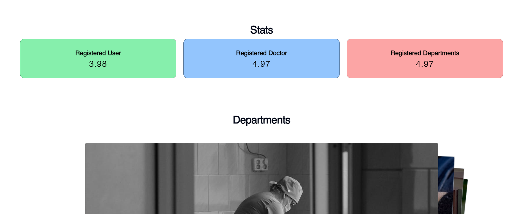

### ``` The Backend Code is not in the repo right now, but will soon get uploaded```

# **SIH Project: CareCrest Multispeciality Hospital Management System**

## **Flow Chart**


## **Overview**
CareCrest Multispeciality Hospital Management System (HMS) is an efficient and comprehensive platform designed to streamline hospital management processes, including patient records, doctor schedules, department information, and medicine tracking. Built using modern web technologies, the system ensures reliability, ease of use, and scalability, meeting the real-world needs of healthcare providers.

This project was developed as part of the **Smart India Hackathon (SIH)** and focuses on:
- **Enhancing efficiency** in hospital operations.
- **Improving patient care** by reducing manual effort.
- **Ensuring data security** and accessibility.

---

## **Sample Images**

Here are some sample screenshots of the project:

<div style="">
   
**Home Page**  


**SignIn Page**  


**LogIn Page**  


**Select Department**  


**Bed Availability**  


**Stats**  


**Joined Queue**  

</div>

---

## **Features**
### **Admin Dashboard**
- Add, update, or delete patient, doctor, department, and medicine records.
- Display key metrics using interactive charts.
- Seamlessly manage time slots and appointments for different departments.

### **Patient Management**
- View and manage patient details.
- Monitor admission history and current status.

### **Doctor and Department Management**
- Manage doctor profiles and schedules.
- Display department-specific information, including images and time slots.

### **Medicine Management**
- Track medicine inventory.
- Add or remove medicines with detailed descriptions and expiry details.

### **Interactive Visualizations**
- Display multi-line charts for data trends (e.g., patient visits, inventory levels).
- Integrated with APIs to fetch real-time data for admin insights.

---

## **Technologies Used**
### **Frontend**
- **React.js** with **Vite** for a fast and interactive UI.
- **Tailwind CSS** for styling with utility-first CSS.

### **Backend**
- **Node.js** with **Express.js** for server-side logic.
- RESTful API implementation for smooth communication.

### **Database**
- **MongoDB** for scalable, NoSQL database management.

---

## **Installation & Setup**
### Prerequisites
- **Node.js** (v16+ recommended).
- **MongoDB** server running locally or via a cloud service.
- **Git** for version control.

### Steps
1. Clone the repository:
   ```bash
   git clone https://github.com/satendra03/sig-1620.git
   ```
2. Navigate to the project directory:
   ```bash
   cd sih-hms
   ```
3. Install dependencies:
   Create a `.env` file:
4. Set up environment variables::
   ```bash
   git clone https://github.com/username/sih-hms.git
   ```
5. Run the project:
   ```bash
   npm run dev
   ```

---
## **For Developers**
### **Prerequisites**
- Familiarity with **React.js**, **Node.js**, and **MongoDB**.
- Basic understanding of REST API development.
- Knowledge of **Chart.js** for visualization.

### **Contribution Guidelines**
- Fork the repository.
- Create a new branch for your feature/bugfix.
- Submit a pull request with proper documentation.

---

## **Future Scope**
- Integration with **Machine Learning models** for predictive analytics.
- Real-time chat system for patient-doctor communication.
- SMS/Email notifications for appointments and updates.
- Enhanced security with multi-factor authentication (MFA).

---

## **Contact & Support**
For any queries or issues, feel free to reach out:

- **Developer:** Satendra Kumar Parteti  
- **Email:** [Satendra Kumar Parteti](mailto:satendrakumarparteti.work@gmail.com)  
- **GitHub:** [GitHub Profile Link](https://github.com/satendra03)  

